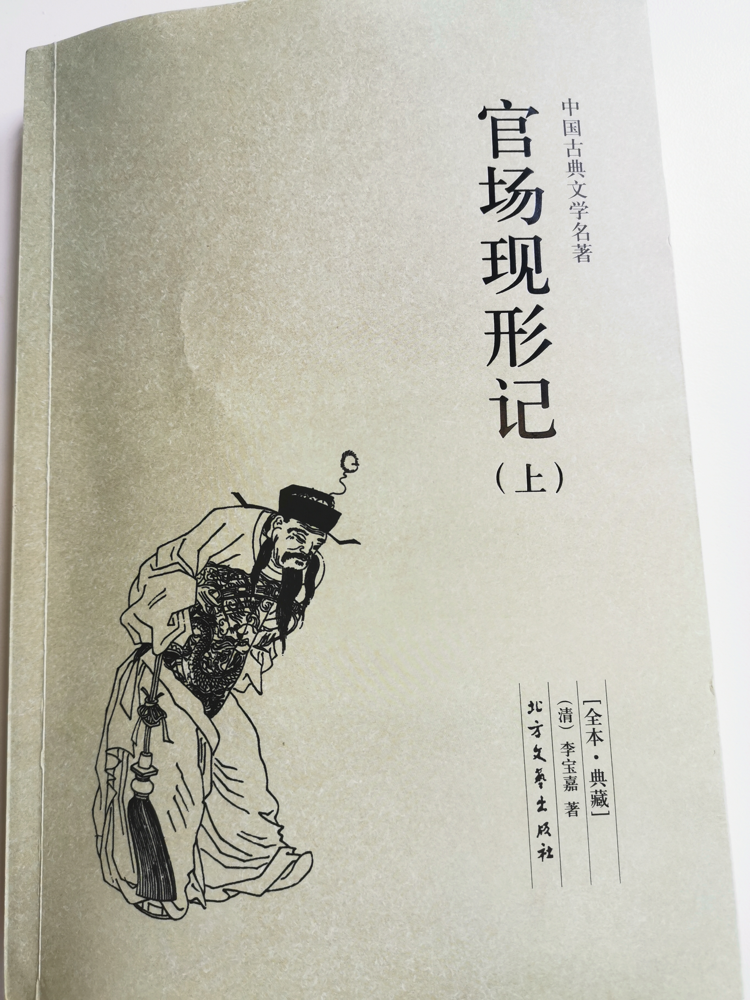

# 李宝嘉《官场现形记》读书笔记

李宝嘉，字伯元，晚清著名小说家。这本《官场现形记》是他最经典的谴责小说。  
全书存本仅六十回，因为作者尚未杀青便因病逝世。  
生死有命，不得不说是一大遗憾。  

相比冯梦龙《三言》比较传统的因果报应+大团圆，《官场现形记》更富有现实意义和指导性。  
因此我选了这本继续阅读，为人处世，时时事事引以为戒。  

- [李宝嘉《官场现形记》读书笔记](#李宝嘉官场现形记读书笔记)
  - [更新日志](#更新日志)
  - [开篇的闲扯](#开篇的闲扯)
  - [前言](#前言)
  - [第一回 望成名学究训顽儿，讲制艺乡绅勖后进](#第一回-望成名学究训顽儿讲制艺乡绅勖后进)
  - [第二回 钱典史同行说官趣，赵孝廉下第受奴欺](#第二回-钱典史同行说官趣赵孝廉下第受奴欺)
  - [第三回 苦钻差黑夜谒黄堂，悲镌级蓝呢糊绿轿](#第三回-苦钻差黑夜谒黄堂悲镌级蓝呢糊绿轿)
  - [第四回 白简留情补祝寿，黄金有价快升官](#第四回-白简留情补祝寿黄金有价快升官)
  - [第五回 藩司卖缺兄弟失和，县令贪赃主仆同恶](#第五回-藩司卖缺兄弟失和县令贪赃主仆同恶)
  - [第六回 急张罗州官接巡抚，少训练副将降都司](#第六回-急张罗州官接巡抚少训练副将降都司)

## 更新日志
|修改人|修改日期|修改内容|
|-|-|-|
|朱里|2021.3.25|阅读第一至第五卷。|
|朱里|2021.5.16|阅读第六卷。|

## 开篇的闲扯
人物次第登场，和吴敬梓的《儒林外史》一样。  
我也有点好奇，看能不能把小说人物和现实里的历史人物对上号。  

另外，自从读了李宗吾《厚黑学》中途放弃，我发现我越来越喜欢字少信息大的文学作品了。  
《厚黑学》虽然是本劝人向善教人学好的书，但车轱辘话太多，实在比不得《Yes Minister》那样精妙绝伦的台词和表演。  
看看《官场现形记》能不能让人眼前一亮。  

## 前言

老佛爷看了都说好，还拿着用来抓人。  
来自官方的认可，畅销畅销。  

## 第一回 望成名学究训顽儿，讲制艺乡绅勖后进

“拉了翰林就有官做，做了官就有钱赚，还要坐堂打人。”  
这一句算是把“权”和“利”凑齐了。  
几千年中国，就这么单调的读书做官，能把人弄得五迷三道，想想也是神奇。  

“当下都让这中举的赵温走在头里，屁股后头才是他爷爷。”  
人上人，可以，这很鬼畜。  

“进去考的时候，祖宗三代都跟了进去。”  
这个到如今也没有半点变化。  

王乡绅的登场算是全书第一个有头有脸的社会人。  
很脸谱化，今天的乡贤还是这样，大差不差。  

## 第二回 钱典史同行说官趣，赵孝廉下第受奴欺

古代科举从最基层选拔人才，从乡试和举孝廉开始。  
一个作为硬性考察，一个作为口碑推荐。  
毕竟古代中国的德治大于法治。  

从本意看，孝廉选的是**德**，科举选的是**才**，德才兼备的当然是贤人了。  
但既然是推举制，这孝和廉就未必真的作为标准去执行了。  
就像现在考军校，难点不是考试本身，而是拿到**推荐报考的资格**。  

另外，古代的等级意识贯穿全社会。  
比如一个农夫的儿子，跟着种田那他也是农夫。  
挑担子就是脚夫，站当铺就是朝奉，端茶壶就是跑堂。  

一旦他**读了书，中了举**，就得给他配个使唤伙计伺候着。  
从此呢，他就是“**公子**”了。  
万般皆下品惟有读书高的社会，就是这么奇怪。  
“巫医乐师百工之人，不耻相师”，这话里就有读书人看不起其他群体的意思在里头。  
可笑可笑。  

“嘴里虽说还礼，两条腿却没有动。”  
社会人表面上热情礼貌，周到得体，其实一举一动都**规矩森严**。  
这就是和社会人打交道**既累又危险**的原因，因为你不知何时犯他的忌讳，更不知他会如何惩罚你。  

这一回通篇只有赵公子一个好人，初出茅庐被所有官场混子嫌弃，还顺便当了全场最佳韭菜。  
算是他的社会第一课吧，实惨。  

## 第三回 苦钻差黑夜谒黄堂，悲镌级蓝呢糊绿轿

本来赵公子出道碰了一鼻子灰，这官场也甭混了。  
结果家里人到底是**识时务**，直接转道奔着捐班去了，聪明。  

这一回里，钱典史巴结实缺的情节挺有意思。  
一方面把蝇营狗苟写得活灵活现，另一方面也反映出晚清官场的**混乱和腐败**。  

混乱尤为明显，官员任免这等大事，居然普遍存在新官到任，原任尚未开缺的情况。  
所谓**纲纪废弛**，也是没谁了。  

我们工薪阶层，往往习惯了契约精神。  
简单明了，按劳取酬。  
殊不知社会人的世界里，办事拿回扣加帽子，不过是入门级的操作了。  

黄知府升任道台，怎一个急如星火，连夜换了新呢子做的大轿。  
第二天收到公文说核查待参，又变了霜打的茄子，士气脾气各掉一半。  
再说他在把兄弟面前，一前一后的姿态，完全凭着自己的**官阶**来决定**举手投足**，戏剧效果可以说拉满了。  
堪称本书第一个点题了“**现形记**”的人物。  

## 第四回 白简留情补祝寿，黄金有价快升官

“戴升鼻子里‘哼’的冷笑一声”。  
通常巴结最殷勤的小人，往往也是捅刀子最用力的恶人。  
很好理解，阴阳要平衡，人性和尊严也一样。  
一个人丢掉的东西，往后总想设法找回来，包括用报复性的手段。  

所以呢，做人就得不卑不亢。  
人必自侮，而后人侮之。  

“所有局里的，营务上的那些委员，一个个都在公馆里等着请安。”  
说这世态炎凉，热了别昏头，冷了也就不至于打摆子。  
一切都是戏，配合出演就行。  

“有明点，有暗点，有补点。”  
之所以要强调**科甲正途**，就是因为不走正途的人，实在太多了。  

“事出有因，查无实据。”  
大事上断案，往往全凭**钦差大人**一句话。  
能秉公执法的海瑞寇准，毕竟万中无一，更多的是**说你行你就行，不行也行**。  

## 第五回 藩司卖缺兄弟失和，县令贪赃主仆同恶

社会人有个**理想模型**，就是大家表面和气，心照不宣，头脑冷静，腿脚勤快。  
如果真是这样，那官僚体制就可以永久统治了。  

实际情况是，人总有出错的时候，纯粹的理性人并不存在。  
于是这一回的主题就成了**社会人翻车现场**。  

另一个有意思的点，是关于“本分”二字。  
社会人总觉得自己比老实人聪明，可以绕开规矩**走捷径**。  
当一群社会人挤在一起，发现又得遵守社会人的规矩，谁不遵守就被干掉。  
譬如黑手党，对此更是直接作为帮规**严格执行**。  
出于**生存恐惧**，社会人又被驯化成另一种层面的“老实人”。  
于是，到底**谁规矩谁老实**呢？  

大荷包三荷包这两兄弟，干的那点勾当就不提了，官场日常。  
但这俩人居然为了一点**面子和脾气**的事，打得跟热窑似的。  
到底是气大伤肝，脑子秀逗连正经事都不管了。  
这种**闹剧**一般还是不多，毕竟为非作歹的人都知道利害关系，误了大事可了不得。  

画面转到王玉梅王老爷这儿，和自己搭伙的**带肚子师爷**，也各怀鬼胎。  
所谓带肚子，也就是我们如今说的“带资进组”。  
起步就是利益联盟，在利益面前，**倒戈和内讧**就如呼吸般自然。  

这和什么群体最像呢？没错，**土匪**。  
你看，官场腐败成这样，当官的自然就和土匪无二。  

“怕的是误了天亮接印，把漕米钱粮被前任收了去。”  
这句简直让人**拍案叫绝**，官老爷们的捐税盘剥，是按天算，**只争朝夕**地收。  
甚至任上最后一天，**最后一笔油水**也要落袋为安。  

这也算是“站好最后一班岗”？  
黑色幽默。  

“说出来的话软的同棉花一样，却是字眼里头都含着刺。”  
**阴阳人**好像是官场必知必会？就恐怖。  
别说官场了，**职场爬梯子**的不少人也这德行。  

## 第六回 急张罗州官接巡抚，少训练副将降都司

“几时来的？”  
“几时走？”  
这架子不愧是军机大臣。  

阎敬铭，谥文介，以清正廉洁、善于理财闻名天下。  
李鉴堂倒是有资料可查，不过在晚清大臣中不太有名。  

“见了这位王协台一脸烟气”，清末官场腐败，官员里抽大烟的就很不少。  
绿营兵上上下下自不在话下。  

这一回三荷包从一个捞油水的官场中介，总算攒足了本钱，自个儿捐了个实缺知州。  
也算“励志”得很。  

抚台大人这趟奉旨阅兵，场面如何浩大，从文字中也可见一斑。  

最有趣的还是结尾作者的一句评论：  
“大凡**革职**的人，一保就可以开复原官；**降调**的人，非一级一级保升上去不可。”  

这招细琢磨，可真是毒了。  
